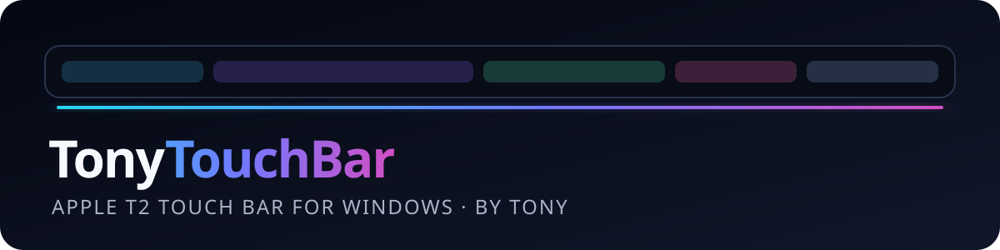

# TonyTouchBar

**Apple T2 Touch Bar for Windows — by Tony.**

TonyTouchBar makes the integrated Touch Bar on supported Intel/T2 MacBook Pro models useful in Windows. It follows what you are doing and becomes a game panel, media timeline, photo toolbar, or live Codex status strip.

> Early preview. The first verified machine is a 2019 16-inch MacBook Pro (`MacBookPro16,1`) with USB device `05ac:8302`. Other T2 Touch Bar models need community testing.

> Preview builds are not yet Authenticode-signed, so Windows may show an unknown-publisher warning. Download only from this repository's Releases page and verify `SHA256SUMS.txt`.

## Why this project

- Keeps **Secure Boot enabled**; no test signing and no custom Windows kernel driver.
- Automatically follows the foreground app or configured game.
- Shows the real application icon and title.
- Supports touch buttons and configurable keyboard shortcuts.
- Uses Windows Global System Media Transport Controls for title, play/pause, ±10 seconds, mute, and a seekable progress bar.
- Works with YouTube and Bilibili when the browser exposes a Windows media session.
- Shows real Codex states such as thinking, using tools, waiting for approval, finished, and interrupted.
- Adds a Photos layout with previous, next, rotate, and delete controls.
- Starts with Windows and reconnects the Touch Bar to WSL automatically.
- Recovers automatically after Windows lock/unlock, sleep, and USB device resets.
- No telemetry, cloud service, or account.

## 中文速览

TonyTouchBar 是 Tony 制作的 Windows Touch Bar 工具。它不要求关闭 Secure Boot，也不安装测试签名内核驱动。切换前台程序时，Touch Bar 会自动切换布局；进入已配置的游戏会显示游戏标题、图标和快捷键；在浏览器播放 B 站或 YouTube 时会显示可点击/拖动的视频进度条。

目前首先支持并实测的是 2019 款 16 英寸 Intel/T2 MacBook Pro。其他带 T2 Touch Bar 的 Intel MacBook Pro 欢迎测试并提交诊断包。

## Install — no terminal required

Download **`TonyTouchBar-Setup.exe`** from Releases and double-click it. Setup checks and installs WSL, Ubuntu, usbipd-win, the Linux bridge, TonyTouchBar, and its Windows startup entry.

- If WSL is already enabled, installation normally finishes in one pass.
- On a new Windows installation, Windows can require one restart while enabling WSL. Setup records its progress and reopens automatically after sign-in.
- Administrator approval is requested only for Windows components and the one-time USB device share.
- Secure Boot stays enabled.
- Codex Live is optional. Codex asks you to review and trust its local hook definition once; Setup cannot and does not bypass that security review.

## Supported hardware

- Windows 11 x64
- An Intel MacBook Pro with Apple T2 Touch Bar device `05ac:8302`

The current hardware-verified model is the 2019 16-inch MacBook Pro (`MacBookPro16,1`). Other Intel/T2 models need community testing.

Advanced users can still download the portable ZIP and run `scripts\Install.ps1` manually.

## Scene-aware layouts

- **Games:** title, real game icon, battery/time, and configurable shortcuts. Forza profiles include screenshot, map, photo mode, and pause.
- **Forza dashboard:** live gear, speed, RPM shift lights, lap/position, screenshot, and Photo Mode for FH5, FH6, and Forza Motorsport.
- **Video:** title, play/pause, ±10 seconds, mute, and a touch-seekable progress bar through Windows media sessions.
- **Photos:** previous/next, rotate, and delete controls that follow the Photos app.
- **Codex Live:** a moving activity strip driven by official lifecycle hooks—not CPU-usage guessing—with distinct states for thinking, working, approval, completion, and interruption.
- **Fn controls:** hold the built-in keyboard's Fn key for brightness down/up, F1–F10, and volume down/up. This uses Apple's signed Boot Camp KeyManager and keeps Secure Boot enabled.

See [the product roadmap](docs/ROADMAP.md) for the richer game telemetry, browser, photo workflow, and creator-mode ideas planned next.

### Enable the Forza dashboard

TonyTouchBar listens for Forza's local Data Out stream on UDP port `5607`. In each Forza title, open the HUD/gameplay options and set:

```text
Data Out: On
Data Out IP Address: 127.0.0.1
Data Out IP Port: 5607
Data Out Packet Format: Car Dash (when shown)
```

This is a one-time setting per game. The dashboard appears automatically while a configured Forza executable is in the foreground and returns to the normal Touch Bar scene when the game exits or loses focus. To use another port, change `forzaTelemetryPort` in `%LOCALAPPDATA%\TonyTouchBar\settings.json`.

Before telemetry arrives, the dashboard stays useful: it shows the game title and icon, clock, battery, an animated game-mode strip, and a ready indicator instead of a connection warning.

The Touch Bar becomes a WSL-owned USB device while TonyTouchBar is active. Windows cannot use it through another driver at the same time.

## Customize game profiles

Edit `%LOCALAPPDATA%\TonyTouchBar\settings.json`, then restart `TonyTouchBar.exe`.

```json
{
  "executable": "MyGame.exe",
  "title": "My Game",
  "accent": "#65278F",
  "shortcuts": [
    { "label": "Map", "key": "M" },
    { "label": "Pause", "key": "ESCAPE" }
  ]
}
```

Supported key names include `A`–`Z`, `0`–`9`, `F1`–`F24`, `ESCAPE`, `TAB`, `SPACE`, `ENTER`, and arrow keys.

## Diagnostics and uninstall

```powershell
powershell -ExecutionPolicy Bypass -File .\scripts\Diagnostics.ps1
powershell -ExecutionPolicy Bypass -File .\scripts\Uninstall.ps1
```

Diagnostics creates a ZIP on the desktop containing only configuration and relevant local status/log output. Review it before uploading to an issue. Uninstall preserves settings and logs unless `-PurgeData` is supplied, and deliberately leaves the persistent usbipd share untouched.

## Build from source

Windows host:

```powershell
dotnet publish .\src\T2TouchBar\T2TouchBar.csproj -c Release -r win-x64 --self-contained true
```

Linux bridge (Ubuntu):

```bash
sudo apt install build-essential libusb-1.0-0-dev
make -C bridge
```

Or create the complete release ZIP from PowerShell 7:

```powershell
.\scripts\Build-Release.ps1 -Version 0.2.0
```

## Architecture and licensing

TonyTouchBar is deliberately split into two processes:

```text
Windows foreground apps / GSMTC
             ↓
 TonyTouchBar.exe (MIT, .NET 8 + SkiaSharp)
             ↓ binary RGBA frames + touch events
 WSL userspace bridge (GPL-2.0-only + libusb)
             ↓ USB/IP
       Apple Touch Bar 05ac:8302
```

The Windows host is MIT licensed. The separately built Linux bridge is GPL-2.0-only because its protocol implementation is based on the Linux `appletbdrm` driver. See [THIRD_PARTY_NOTICES.md](THIRD_PARTY_NOTICES.md).

Apple, MacBook Pro, Touch Bar, Windows, YouTube, and Bilibili are trademarks of their respective owners. TonyTouchBar is an independent community project and is not affiliated with or endorsed by them.
